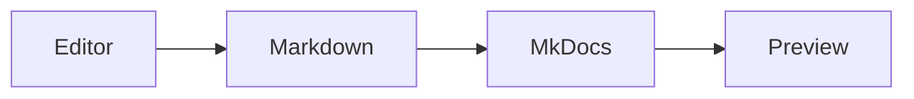
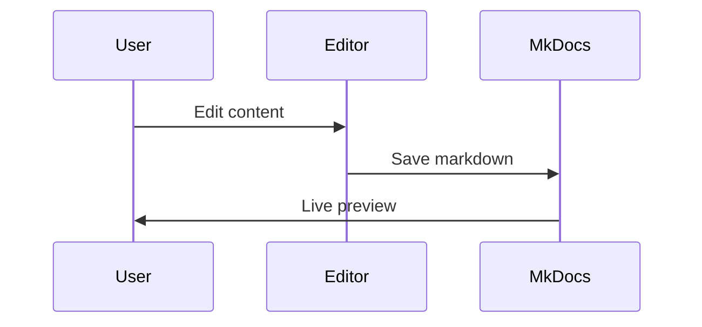

# Welcome to Sample Site

This is a sample MkDocs Material project for testing the MaterialDocs Editor.

## Features

- **WYSIWYG Editing**: Edit your docs with a visual editor
- **Live Preview**: See changes instantly with mkdocs serve
- **Material Design**: Beautiful Material theme

!!! note "Getting Started"
Check out the [Installation Guide](getting-started/installation.md) to begin.

    This admonition supports multiple paragraphs and nested content.

!!! warning "Important Notice"
Be sure to save your work frequently!

!!! tip "Pro Tip"
Use keyboard shortcuts for faster editing:

    - `Ctrl+S` to save
    - `Ctrl+O` to open project

??? info "Collapsible Section"
This content is hidden by default. Click the header to expand.

    You can include code blocks inside admonitions too!

???+ example "Open by Default"
This collapsible admonition starts expanded.

## Quick Example

```python
def hello_world():
    """A simple greeting function."""
    print("Hello, MkDocs!")

# Call the function
hello_world()
```

```javascript title="example.js"
function greet(name) {
  console.log(`Hello, ${name}!`);
}

greet("World");
```

```yaml title="mkdocs.yml"
site_name: My Site
theme:
  name: material
markdown_extensions:
  - admonition
  - pymdownx.superfences
```

## Architecture




